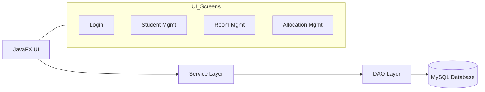

# Dormitory Management System – Simple Design & Team Breakdown

## 1) Simple System Design (High Level)

The application follows a straightforward layered design:

```
[JavaFX UI]
     |
     v
[Service Layer]
     |
     v
[DAO Layer] ---> [MySQL Database]
```

- **JavaFX UI**: Screens for login, student management, room allocation, etc.
- **Service Layer**: Business rules (validation, allocation logic).
- **DAO Layer**: CRUD operations to/from MySQL.
- **MySQL Database**: Stores users, students, rooms, applications, allocations.

## 2) Simple Data Flow (What happens in a common action)

Example: *Allocate a student to a room*

1. **UI**: Admin chooses student + room.
2. **Service**: Checks room capacity and student eligibility.
3. **DAO**: Updates allocation in DB and marks room occupancy.
4. **UI**: Shows confirmation and updated room list.

## 3) Diagram (Mermaid)



## 4) Team Breakdown (6 students)

Assign each student to one clear layer or responsibility so work doesn’t overlap.

1. **Student A – UI/UX (JavaFX Views & Controllers)**
   - Build/organize screens: Login, Student Management, Room Management, Allocation.
   - Wire FXML + controller events to services.

2. **Student B – Service Layer (Business Logic)**
   - Implement validation rules (room capacity, eligibility, role permissions).
   - Write service methods for allocations, CRUD operations, and reports.

3. **Student C – DAO Layer (Database Access)**
   - Implement DAO classes for Students, Rooms, Allocations, Users.
   - Ensure clean CRUD and SQL query correctness.

4. **Student D – Database Design & Schema**
   - Verify schema in `schema_mysql.sql` (tables, keys, constraints).
   - Add indexes/constraints if needed.

5. **Student E – Models & Utilities**
   - Maintain model classes (User, Student, Room, Allocation, Application).
   - Ensure helpers (DB connection, password hashing) are stable.

6. **Student F – Testing, Docs & Integration**
   - Test flows end-to-end (login, add student, allocate room).
   - Maintain documentation (README, DESIGN.md) and ensure integration builds.

## 5) Suggested Workflow

- Each student works in their own branch.
- Merge after code review.
- Run `mvn clean javafx:run` before final merge.
